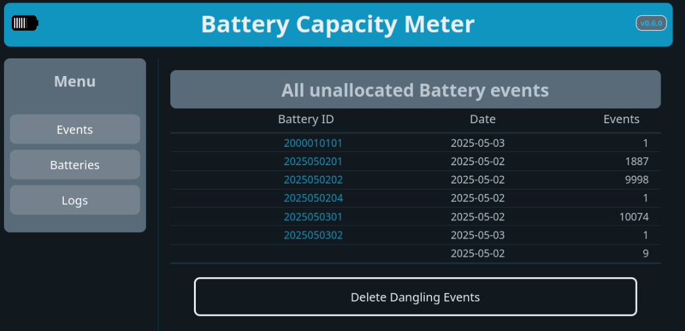

Battery Capacity Meter UI
=========================

Introduction
------------

This is a UI for the **Battery Capacity Meter** ([BCM][]) hardware project.

I allows viewing and managing Batteries and any capacity measurements that have
been made on the hardware.

When a battery's capacity is measure, the battery is given a unique ID and
recorded on the [BCM][]. The [BCM][] is then set to measure capacity which will
broadcast measurement telemetry to an [MQTT][] broker.

These messages are then collected by a [NodeRED][] flow and recorded in a
[PostgreSQL][] database.

This UI will then use the data the DB to present the management and view
screens.

Stack
-----

* [Microdot][]: minimalistic Python web framework
* [HTMX][]: library that allows accessing modern browser features directly from
        HTML, rather than using JavaScript.
* [PicoCSS][]: minimalist and lightweight starter kit that prioritizes semantic
           syntax, making every HTML element responsive and elegant by default.

There is also a set of technical [app docs][] generated by [pydoctor][] available

Production Deployment
---------------------

The production version can be found [here](http://darwin.gaul.za:8088/)

<!-- Links -->
[BCM]: http://gitlab.gaul.za/gaulnet/battery-capacity-meter
[MQTT]: https://mqtt.org
[NodeRED]: https://nodered.org/docs
[PostgreSQL]: https://www.postgresql.org/
[Microdot]: https://microdot.readthedocs.io/en/latest/
[HTMX]: https://htmx.org/
[PicoCSS]: https://picocss.com/
[pydoctor]: https://pydoctor.readthedocs.io/
[app docs]: http://gaulnet.pages.gaul.za/battery-capacity-meter-ui/

