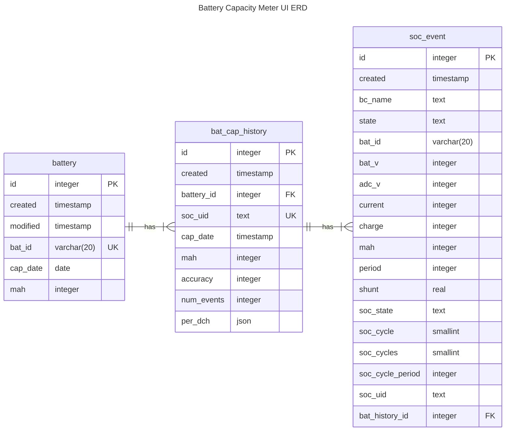

Battery Capacity ERD
====================

```mermaid
---
title: Battery Capacity Meter UI ERD
---

erDiagram
    direction LR
    battery {
        id integer PK
        created timestamp
        modified timestamp
        bat_id varchar(20) UK
        cap_date date
        mah integer
    }

    bat_cap_history {
        id integer PK
        created timestamp
        battery_id integer FK
        soc_uid text UK
        cap_date timestamp
        mah integer
        accuracy integer
        num_events integer
        per_dch json
    }

    soc_event {
        id integer PK
        created timestamp
        bc_name text
        state text
        bat_id varchar(20)
        bat_v integer
        adc_v integer
        current integer
        charge integer
        mah integer
        period integer
        shunt real
        soc_state text
        soc_cycle smallint
        soc_cycles smallint
        soc_cycle_period integer
        soc_uid text
        bat_history_id integer FK
    }

    bat_cap_history ||--|{ soc_event: "has"
    battery ||--|{ bat_cap_history: "has"
```
