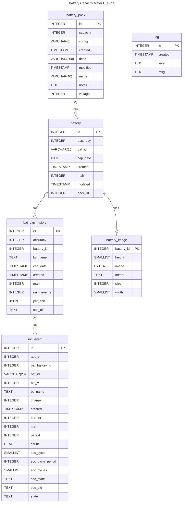

# Battery Capacity Meter ERD

```mermaid
---
title: Battery Capacity Meter UI ERD
---
erDiagram
soc_event {
 INTEGER id PK
   INTEGER adc_v 
   INTEGER bat_history_id 
   VARCHAR(20) bat_id 
   INTEGER bat_v 
   TEXT bc_name 
   INTEGER charge 
   TIMESTAMP created 
   INTEGER current 
   INTEGER mah 
   INTEGER period 
   REAL shunt 
   SMALLINT soc_cycle 
   INTEGER soc_cycle_period 
   SMALLINT soc_cycles 
   TEXT soc_state 
   TEXT soc_uid 
   TEXT state 
}
bat_cap_history {
 INTEGER id PK
   INTEGER accuracy 
   INTEGER battery_id 
   TEXT bc_name 
   TIMESTAMP cap_date 
   TIMESTAMP created 
   INTEGER mah 
   INTEGER num_events 
   JSON per_dch 
   TEXT soc_uid 
}
battery {
 INTEGER id PK
   INTEGER accuracy 
   VARCHAR(20) bat_id 
   DATE cap_date 
   TIMESTAMP created 
   INTEGER mah 
   TIMESTAMP modified 
   INTEGER pack_id 
}
battery_pack {
 INTEGER id PK
   INTEGER capacity 
   VARCHAR(8) config 
   TIMESTAMP created 
   VARCHAR(200) desc 
   TIMESTAMP modified 
   VARCHAR(40) name 
   TEXT notes 
   INTEGER voltage 
}
log {
 INTEGER id PK
   TIMESTAMP created 
   TEXT level 
   TEXT msg 
}
battery_image {
 INTEGER battery_id PK
   SMALLINT height 
   BYTEA image 
   TEXT mime 
   INTEGER size 
   SMALLINT width 
}
bat_cap_history one or zero--0+ soc_event : has
battery one or zero--0+ bat_cap_history : has
battery_pack one or zero--0+ battery : has
battery one or zero--zero or one battery_image : has


```
